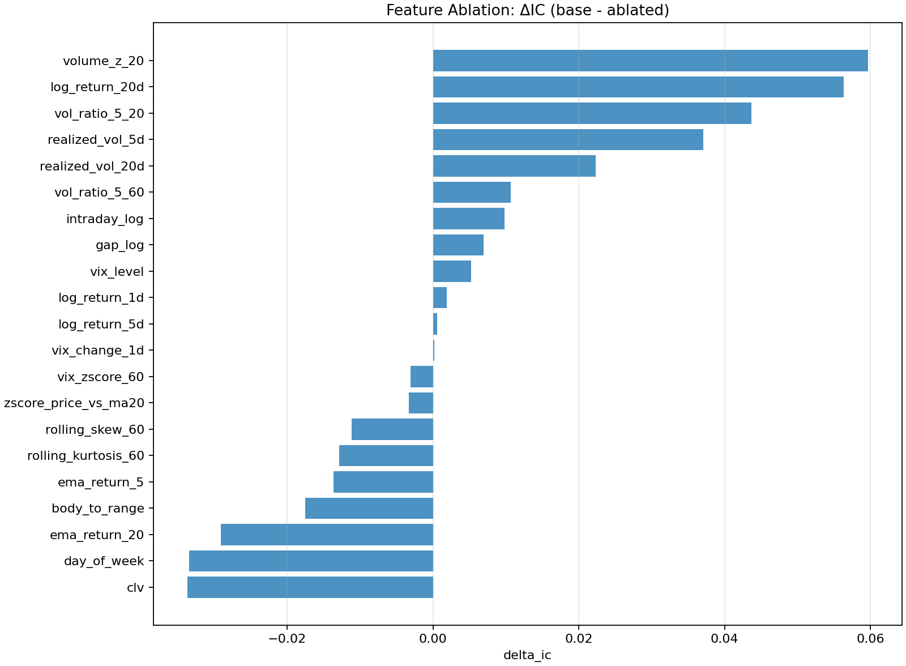
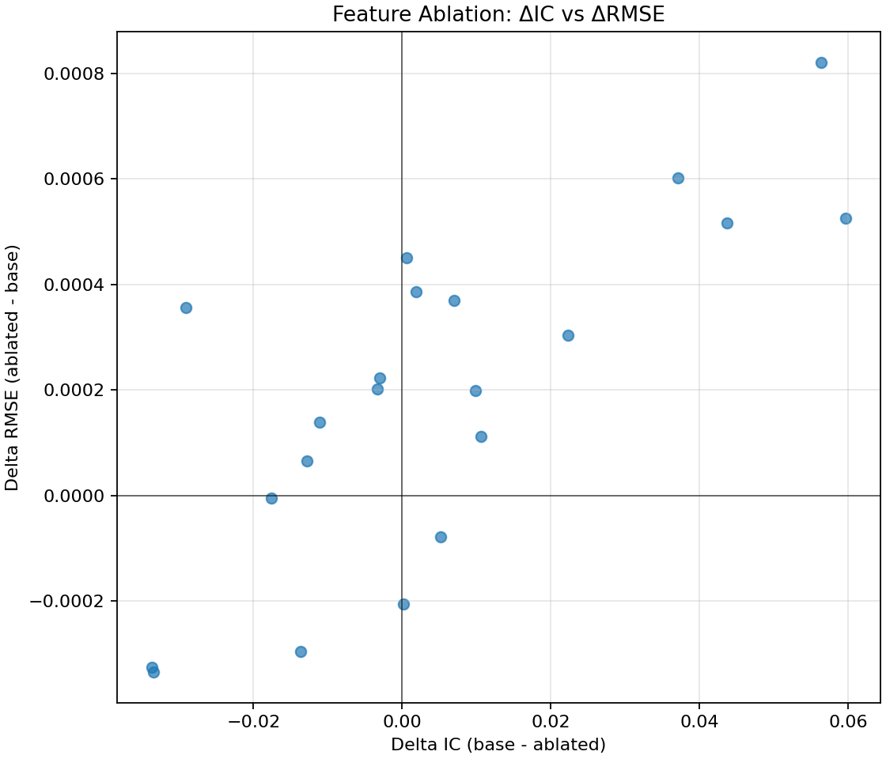
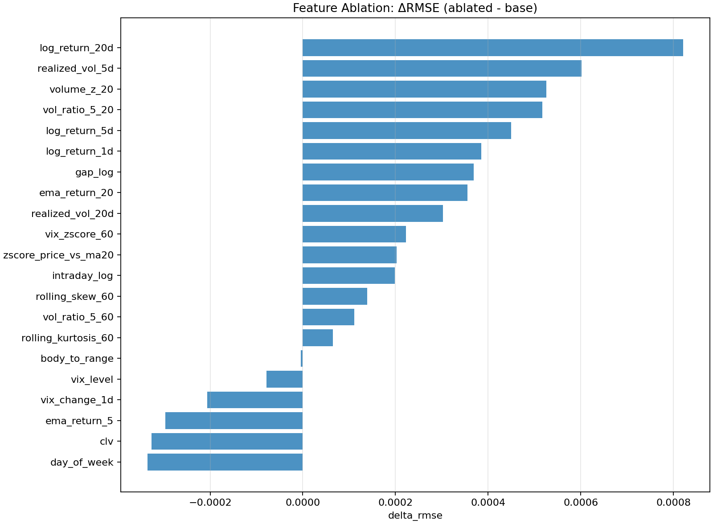

## Ablation des features

La sélection des variables du modèle LSTM n’a pas été faite uniquement de manière intuitive. Une étape spécifique d’**ablation de features** a été mise en place pour mesurer, de manière empirique, l’utilité réelle de chaque variable dans la prédiction du retour futur. L’idée générale est simple : on entraîne d’abord un modèle de référence avec l’ensemble complet des features, puis on retire une feature à la fois et on réentraîne entièrement le modèle. On compare ensuite les performances du modèle amputé au modèle de base.

Cette procédure est implémentée dans le module d’ablation. Le pipeline commence par reconstruire le dataset de base à partir des données brutes et des features calculées par `build_features`. Les variables explicatives sont générées exactement comme dans la pipeline LSTM standard, puis la cible est construite comme un **log-return futur** à horizon `h`, c’est-à-dire :

`target_t = log(C_(t+h) / C_t)`

Ici, on travaille avec `h = 1`, donc avec le rendement logarithmique du lendemain. Une fois le dataset construit, les données sont séparées chronologiquement en ensembles `train`, `validation` et `test` via `compute_split_masks`. Cette contrainte est essentielle : aucune observation future ne doit être utilisée pour entraîner ou normaliser le modèle. Le scaling des variables est ensuite effectué uniquement à partir du train grâce à `scale_features`, puis les séquences sont construites avec `make_sequences` pour former les entrées du LSTM.

Le principe de l’ablation est alors le suivant. Soit un ensemble complet de features `F = {f_1, ..., f_p}`. On entraîne d’abord un modèle de référence avec toutes les features. Ensuite, pour chaque feature `f_i`, on construit un nouveau dataset contenant `F \ {f_i}`, c’est-à-dire toutes les variables sauf celle-ci. Le modèle est réentraîné entièrement sur cette nouvelle base, avec la même architecture, les mêmes hyperparamètres, la même longueur de séquence et la même logique de séparation temporelle. Le code ne se contente donc pas de neutraliser la variable ; il refait un apprentissage complet sans elle, ce qui donne une mesure plus fidèle de sa contribution réelle.

Deux quantités sont ensuite calculées pour comparer le modèle de base au modèle ablaté :

- `delta_ic = IC_base - IC_ablated`
- `delta_rmse = RMSE_ablated - RMSE_base`

Ces deux différences se lisent de manière très directe. Si `delta_ic` est positif, cela signifie que retirer la feature fait baisser l’Information Coefficient, donc que cette feature apportait bien du signal. Plus `delta_ic` est grand, plus la variable semble importante pour la corrélation entre prédictions et rendements réels. De même, si `delta_rmse` est positif, cela signifie que le RMSE se dégrade quand on retire la feature, donc que la variable aidait aussi en précision brute. À l’inverse, une valeur négative suggère que la suppression de la feature améliore la métrique considérée, ce qui indique soit une variable peu utile, soit une variable redondante, soit parfois une variable qui ajoute du bruit ou de l’instabilité.

Dans le code, cette logique apparaît dans la fonction `run_ablation`. Après l’entraînement du modèle de référence, le pipeline boucle sur chaque feature. Pour chacune d’elles, un nouveau sous-ensemble est construit, puis `train_eval_for_features` est appelé. Cette fonction refait tout le cycle : scaling, création des séquences, création des `DataLoader`, instanciation du `LSTMRegressor`, apprentissage via `train_model`, puis prédictions sur le test avec `predict_array`. Les métriques sont ensuite calculées avec `compute_pred_metrics_extended`. Les résultats sont sauvegardés dans le dossier suivant :

`market-ml/feature_ablation/aapl_h1/20260304_170534/`

Les graphiques utilisés pour l’analyse sont disponibles dans :

`market-ml/results_lstm/feature_ablation/aapl_h1/20260304_170534/plots/`

---

### Interprétation des résultats

Les figures ci-dessous permettent de visualiser l’impact de chaque feature sur les performances du modèle.

#### Importance des features via ΔIC

Cette figure classe les variables selon leur contribution à l’Information Coefficient. Les features les plus importantes sont :

- `volume_z_20`
- `log_return_20d`
- `vol_ratio_5_20`
- `realized_vol_5d`
- `realized_vol_20d`

Cela montre que le modèle repose principalement sur deux types d’information :

- le **régime de marché** (volume et volatilité),
- le **momentum moyen terme** (notamment à 20 jours).

Le fait que `volume_z_20` soit la feature la plus importante indique que les anomalies de volume jouent un rôle clé dans la détection de changements de régime.

---

#### Analyse conjointe ΔIC / ΔRMSE

Ce graphique permet d’identifier les features robustes.

- En haut à droite : features utiles (IC et RMSE se dégradent si on les retire)
- En bas à gauche : features nuisibles

Les variables les plus robustes sont :

- `volume_z_20`
- `log_return_20d`
- `vol_ratio_5_20`
- `realized_vol_5d`

Ces variables améliorent à la fois la qualité du signal et la précision du modèle.

---

#### Impact sur le RMSE

Les features les plus importantes en termes d’erreur sont :

- `log_return_20d`
- `realized_vol_5d`
- `volume_z_20`
- `vol_ratio_5_20`

Cela confirme que le modèle s’appuie fortement sur le **momentum long** et la **volatilité récente**.

---

### Features peu utiles ou nuisibles

Certaines variables présentent des contributions négatives.

- `clv` : améliore les performances lorsqu’elle est supprimée → bruit
- `day_of_week` : effet calendaire non exploité par le modèle
- `ema_return_5` et `ema_return_20` : probablement redondantes avec les log returns
- `body_to_range` : information trop locale / bruitée
- `vix_change_1d` : choc trop court terme, peu exploitable

Ces features ont été supprimées du modèle final.

---

### Conclusion

L’ablation a permis de transformer un ensemble initial de features en un ensemble **optimisé empiriquement**.

Le modèle final repose principalement sur :

- des variables de **volatilité et de régime**,
- des variables de **momentum multi-horizon**,
- quelques variables de contexte (VIX, gap).

Cette approche garantit que chaque feature conservée apporte réellement de l’information, et limite fortement le bruit et la redondance dans le modèle.