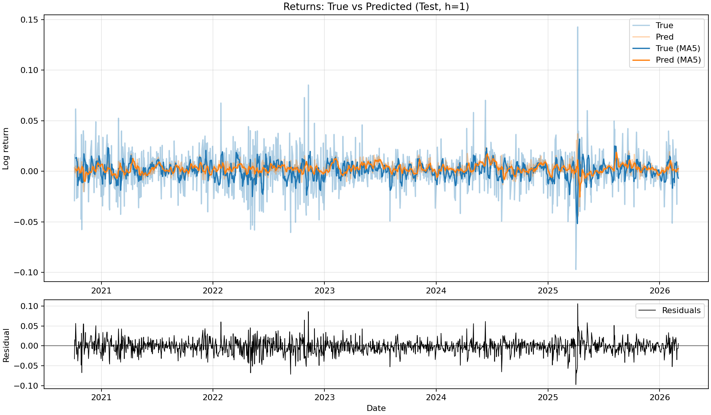
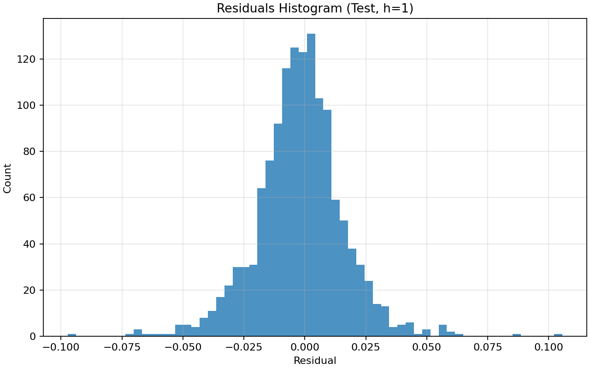
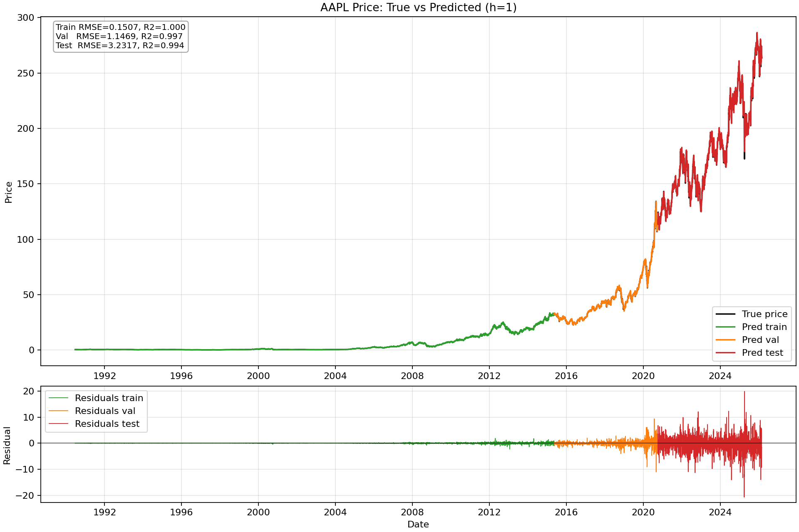
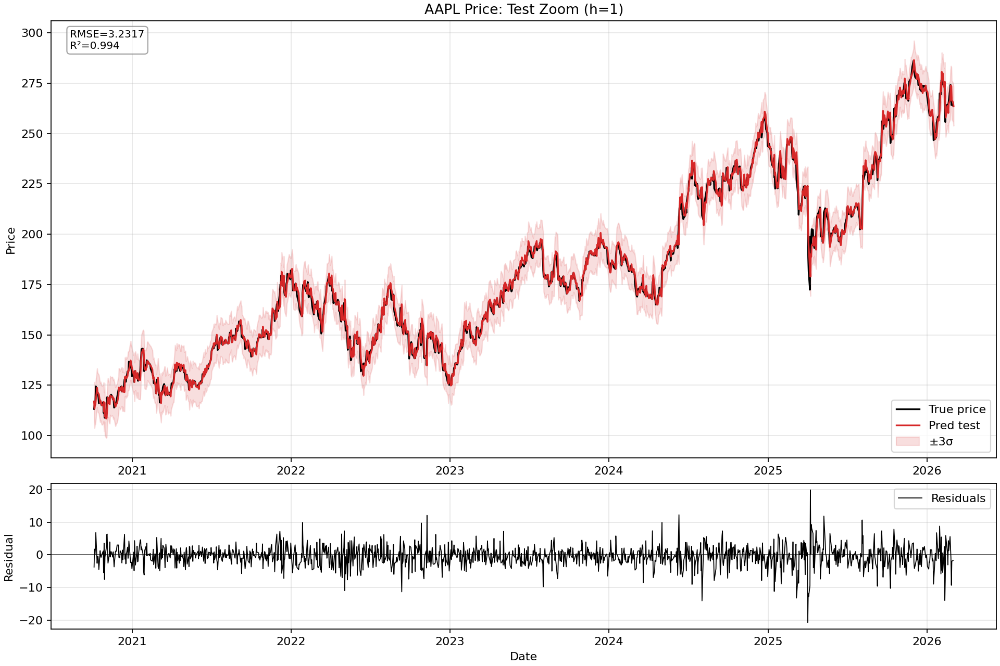
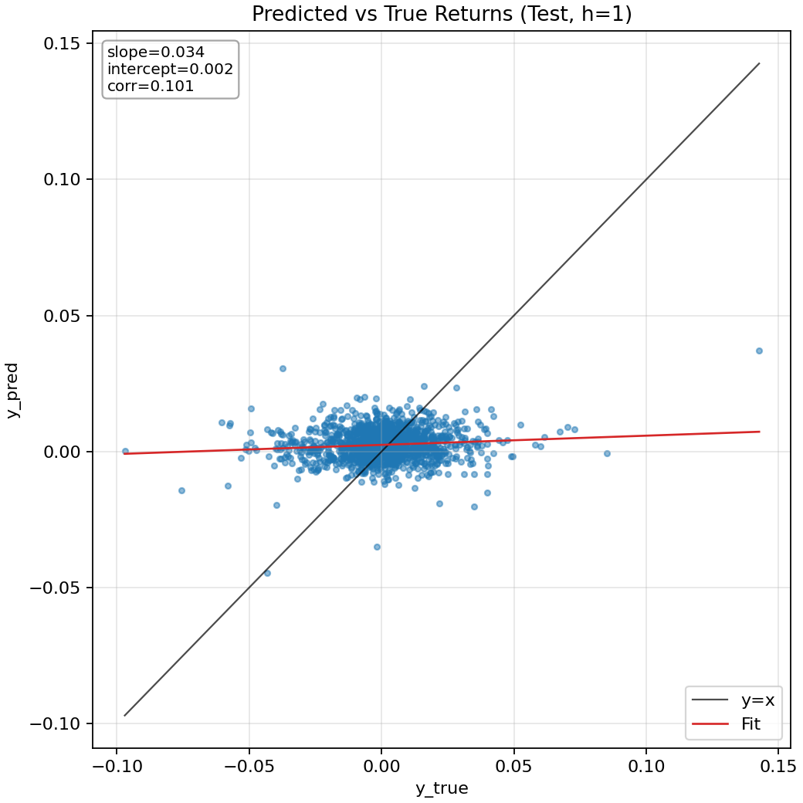

## Résultats du modèle LSTM

Cette section présente les résultats du modèle LSTM sur l’ensemble de test. L’objectif n’est pas seulement de vérifier la qualité de la prédiction, mais surtout d’évaluer si le modèle produit un **signal exploitable en pratique**.

---

### Prédictions vs retours réels

Ce graphique compare les retours réels (`true`) et prédits (`pred`) sur l’ensemble de test.

On observe plusieurs éléments importants :

- Les prédictions sont **beaucoup plus lisses** que les retours réels.
- Le modèle capte globalement la **direction moyenne** mais ne reproduit pas les pics extrêmes.
- Les variations brutales (spikes) sont très peu anticipées.

Interprétation :

C’est un comportement classique des modèles de régression sur des séries financières. Le bruit domine largement le signal (rapport signal sur bruit faible), et le modèle apprend essentiellement la composante **prévisible et persistante**. Il agit donc comme un filtre.

👉 Point positif :
- Le modèle ne sur-réagit pas au bruit → bon signe pour une stratégie stable.

👉 Limite :
- Les événements extrêmes (crash, spikes) ne sont pas capturés → risque sous-estimé.

---

### Analyse des résidus

Les résidus (erreurs de prédiction) sont centrés autour de zéro, ce qui indique l’absence de biais global.

Cependant :

- On observe des **pics de résidus importants**, notamment en périodes de forte volatilité.
- La variance des résidus semble **non constante** (hétéroscédasticité).

Interprétation :

Le modèle ne capture pas complètement les changements de régime extrêmes. Il reste performant dans des régimes “normaux”, mais perd en précision lors des phases de stress.

---

### Distribution des résidus

La distribution des résidus est proche d’une loi normale centrée, mais avec :

- des **queues épaisses (fat tails)**,
- quelques outliers significatifs.

Interprétation :

- Le modèle est globalement bien calibré.
- Mais il sous-estime les événements rares (ce qui est typique en finance).

Point critique :

Cela confirme que le modèle n’est pas adapté pour prédire les extrêmes, mais plutôt pour capter un **signal moyen faible mais stable**.

---

### Prédiction des prix

Ce graphique montre la reconstruction du prix à partir des prédictions.

Les métriques affichées :

- Train RMSE ≈ 0.15
- Val RMSE ≈ 1.15
- Test RMSE ≈ 3.23
- R² très élevé (~0.99)

Attention, ces métriques sont **trompeuses** : Le prix est une série très autocorrélée, même un modèle naïf peut obtenir un R² élevé.
L'interprétation correcte est la suivante : Le modèle suit bien la tendance globale du prix, mais cela ne signifie pas qu’il prédit correctement les retours.

---

### Zoom sur la période de test

Ce zoom permet de mieux visualiser les écarts entre prix réel et prédit.

On observe une bonne capacité à suivre les tendances. Cependant les erreurs sont plus importantes lors des retournements rapides.

Les bandes ±3σ illustrent l’incertitude. La majorité des points restent dans l’intervalle; il y a néanmoins certains dépassements, ce qui traduit le fait que le modèle ne capture pas les événements extrêmes.

Le modèle est alors fiable dans des conditions normales, mais moins robuste en phase de stress.

---

### Relation prédictions vs réalité

Ce scatter plot est central pour l’analyse.

Résultats :

- corr ≈ 0.10
- slope ≈ 0.034

Interprétation :

- Corrélation faible mais positive → signal exploitable.
- Pente très faible → le modèle sous-estime fortement l’amplitude.

C’est exactement ce qu’on attend d’un modèle de trading : il n'est pas nécessaire d'avoir une forte précision. Mais il est essentiel d'avoir un signal légèrement corrélé et stable. 

---
## Conclusion critique

D’un point de vue quantitatif, le modèle présente plusieurs qualités intéressantes. Le signal généré est globalement stable et peu sensible au bruit de marché, ce qui est essentiel dans un contexte financier où la majorité des variations sont aléatoires. La corrélation observée entre les prédictions et les retours futurs reste faible mais positive, ce qui est suffisant pour construire des stratégies exploitables. Le comportement du modèle est également cohérent avec les résultats de la sélection de variables : il s’appuie principalement sur des dynamiques de momentum et des indicateurs de régime de volatilité, ce qui correspond bien à l’intuition économique.

Cependant, certaines limites doivent être clairement reconnues. Le modèle est incapable de prédire correctement les événements extrêmes, comme les mouvements brusques liés à des chocs de marché. Il tend également à sous-estimer systématiquement l’amplitude des variations, ce qui se traduit par des prédictions plus lissées que la réalité. Par ailleurs, l’analyse des résidus montre une variance non constante, ce qui indique que certaines structures de volatilité ne sont pas entièrement capturées. Enfin, les métriques basées sur le prix, comme le R², peuvent donner une impression trompeuse de performance en raison de la forte autocorrélation des séries de prix.

Au final, ce modèle ne doit pas être interprété comme un outil de prédiction précise des rendements. Il produit plutôt un signal faible mais relativement robuste, capable de capter une information directionnelle exploitable. Pris isolément, ce signal reste insuffisant pour une prise de décision directe, mais il devient pertinent lorsqu’il est intégré dans une stratégie plus large, par exemple via des mécanismes de filtrage ou d’allocation dynamique. C’est précisément cette approche qui est développée dans la suite du projet.